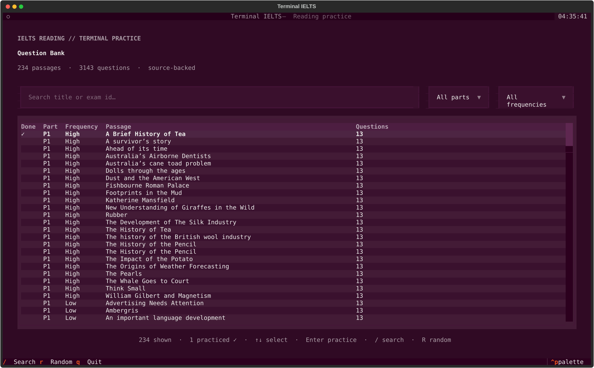
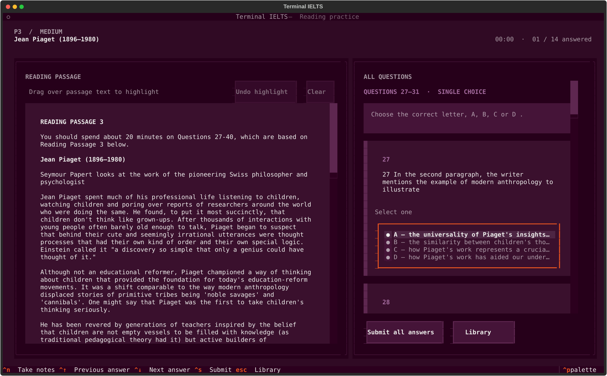
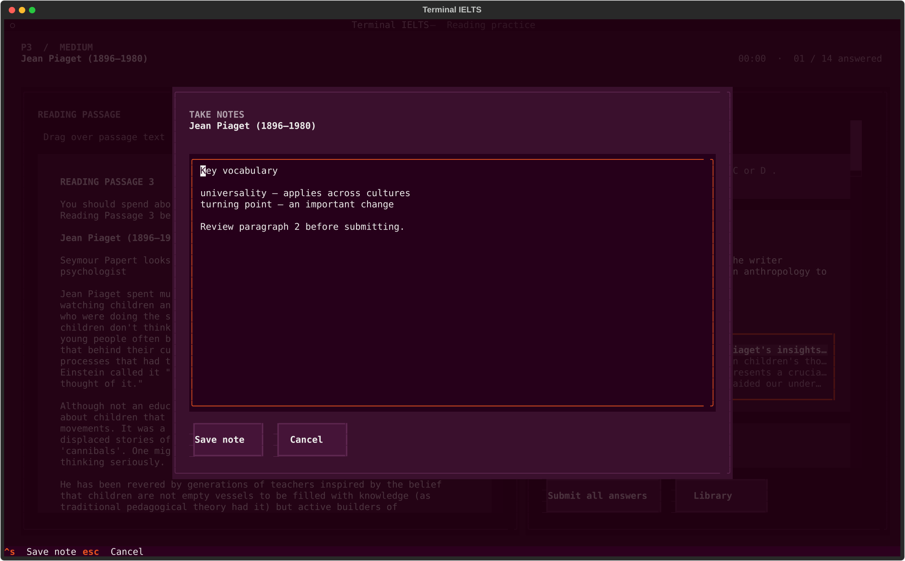

# Terminal IELTS

A terminal-style IELTS Reading practice application built with Python and
[Textual](https://textual.textualize.io/). Its question bank is extracted from a
complete local source snapshot of
[`sallowayma-git/IELTS-practice`](https://github.com/sallowayma-git/IELTS-practice).

## Screenshots

### Question bank



### Split-pane practice



### Take notes



## What it includes

- A complete, unmodified upstream source tree in `source/IELTS-practice/`
- A reproducible extractor for the generated reading exam assets
- Passage, question, option, and answer-key extraction
- Search plus part/frequency filtering
- English-only passage titles in the library and practice header
- Split-pane reading practice with every answer field visible together,
  scoring, corrections, and local attempt history
- Responsive practice layout: below 120 columns, one full-width pane is shown
  at a time and the existing bottom Footer entry (or F2) switches Reading/Questions
- Persistent passage highlights created by mouse drag, with click-to-remove,
  undo-last, and clear-all controls
- Drag-selected passage text is highlighted; Ctrl+C copies the current
  selection, while F3 or Ctrl+G copies the complete rendered article as plain text
- Per-passage notes opened with Ctrl+N and saved independently of submissions
- Radio buttons for every source single-choice control (including TRUE/FALSE
  and YES/NO), with complete option text; checkboxes for genuine multi-select
- Dropdown selectors for matching, classification, sentence-ending, and
  heading questions, showing the complete label while recording its score value
- Sentence/notes completion rendered once in its original paragraph layout;
  a native editor highlights and fills each inline blank without duplicating it
- Word-bank summaries rendered once with inline Select slots instead of
  repeating the whole paragraph for every question
- Per-attempt start/end time, duration, attempted count, weighted accuracy,
  and backward-compatible history statistics
- A muted Ubuntu/GNOME Terminal-style aubergine theme, enabled by default;
  Ubuntu orange is reserved for keyboard focus rather than large bright areas
- Keyboard-first controls in a Textual interface

The current extraction contains **234 reading passages and 3,143 questions**.
Every manifest entry has a matching source asset, and every extracted question
has a non-empty answer key.

The upstream question content is for personal learning and carries the source
project's copyright and distribution restrictions. Keep it local and do not
redistribute the extracted bank.

## Run

```bash
uv sync
uv run terminal-ielts
```

Useful keys:

- `/` focuses search
- `Enter` opens the selected passage or moves to the next answer field
- `F2` switches Reading/Questions in narrow terminals (the Footer entry is clickable)
- `F3` or `Ctrl+G` copies the complete reading passage as plain text (`Fn+F3`
  may be required when macOS reserves the function key)
- `Ctrl+N` opens Take Notes; inside the editor, `Ctrl+S` saves and `Escape` cancels
- `Ctrl+Up` / `Ctrl+Down` move between answer fields
- `Ctrl+S` submits and scores the passage
- `Escape` returns to the library
- `Q` quits from the library
- `Ctrl+P` opens the command palette, including Textual's theme selector

Practice data is loaded from and atomically saved to `~/.terminal_ielts.json`.
The single file contains submitted attempts plus unfinished progress. It stores
answers, inline blank values, active practice time, detailed question results,
accuracy, and per-passage notes; reopening an unfinished passage restores it without counting time
spent outside the practice screen. Submitted passages display `✓` in the library.
Legacy `practice_history.jsonl` in the launch directory is imported when the new
default store does not yet exist, and `history-stats --history` still accepts a
legacy JSONL path.

View aggregate practice statistics (legacy history rows are also accepted):

```bash
uv run terminal-ielts history-stats
```

Inside a paragraph completion editor, `Tab` / `Shift+Tab` moves between blanks.

## Clipboard

Clipboard integration uses native system commands:

- macOS: `pbcopy`
- Linux Wayland: `wl-copy`
- Linux X11: `xclip` or `xsel`

On Linux, install the helper that matches your session type:

```bash
# Wayland (most modern GNOME/KDE desktops)
sudo apt install wl-clipboard

# X11
sudo apt install xclip
```

If no native helper is installed, the app shows a warning such as
`Clipboard unavailable: install wl-clipboard ...` and falls back to the
terminal's OSC 52 clipboard support, which only works in terminals that
support it (e.g. Kitty, Alacritty).

When launching the app from a `.desktop` file, systemd user unit, or other
context that strips environment variables, `wl-copy` may not find the
Wayland socket.  The app now re-injects sensible defaults for
`XDG_RUNTIME_DIR` and `WAYLAND_DISPLAY` automatically; if you still have
issues, launch it from the terminal where `wl-copy` works, or export them
before launching:

```bash
export XDG_RUNTIME_DIR=/run/user/$(id -u)
export WAYLAND_DISPLAY=wayland-0
uv run terminal-ielts
```

## Re-extract the bank

After updating or replacing the full source snapshot, rebuild the packaged JSON bank with:

```bash
uv run terminal-ielts extract
```

Inspect its coverage with:

```bash
uv run terminal-ielts stats
```

## Verify

```bash
uv run python -m unittest discover -s tests -v
uv run python -m compileall -q src tests
```
